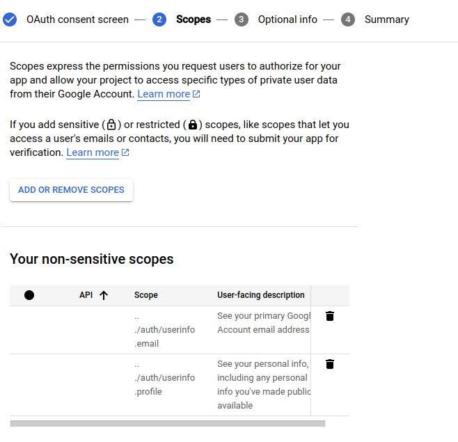
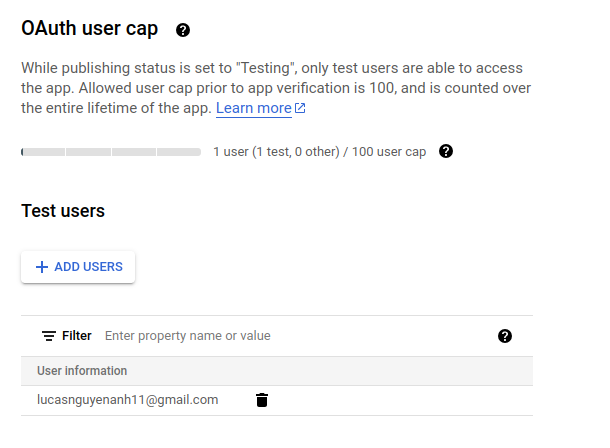
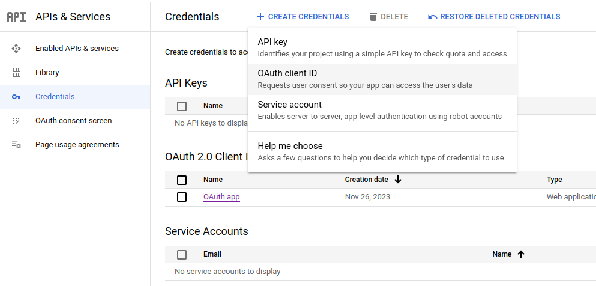
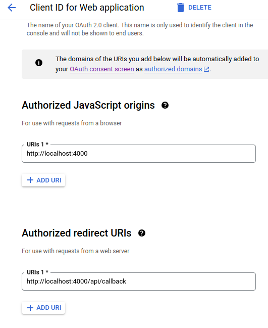

```
step1: https://console.cloud.google.com/

step2: Create project

step3: Create "OAuth consent screen"  (add email testing user to log in with google (unnecessary))



step4: Create "credentials" for OAuth Client ID (get client id, secret id and setup redirect URL + call back url)



step5: npm install

step6:  node server.js

```
